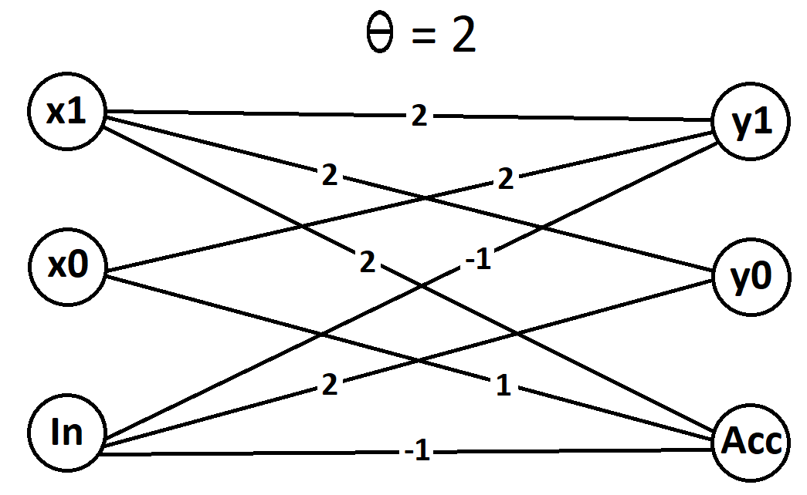
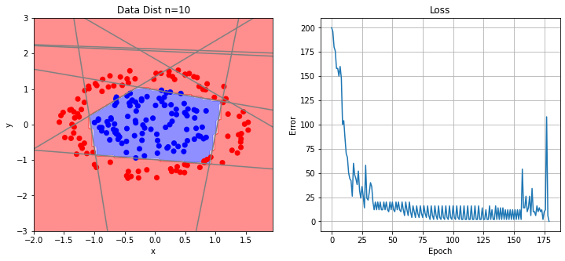
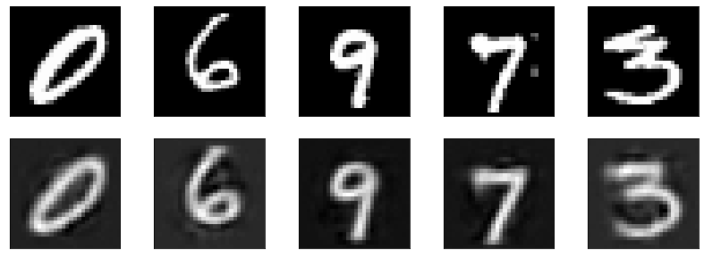
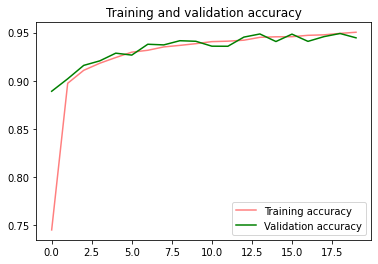
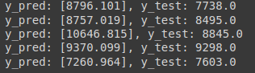

# Neural Networks & Deep Learning - Computer Assignment #1 - Fall 2022
## University of Tehran
### MLPs, RBM

* Q1: McCulloch-Pitts Model

* Q2: AdaLine and MadaLine Algorithms for Learning

* Q3: Auto-Encoders for classification

* Q4: MLP using Keras (House Price Prediction)

